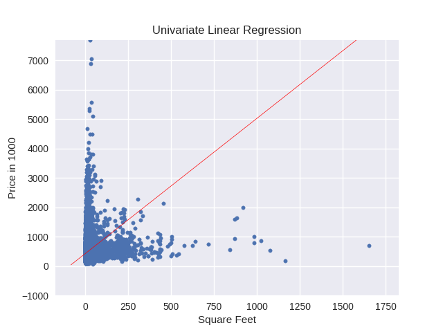

# Univariate-Linear-Regression
Univariate Linear Regression using Gradient descent

## Dataset Description:
### URL: 
https://www.kaggle.com/harlfoxem/housesalesprediction

### Features: 
19 house features plus the price and the id columns, along with 21613 observations.

### Features used:
Target value: Price
Samples feature: Square Feet of plot

### Description: 
This dataset contains house sale prices for King County, which includes Seattle. It includes homes sold between May 2014 and May 2015.

### Plotting graph for regression model
